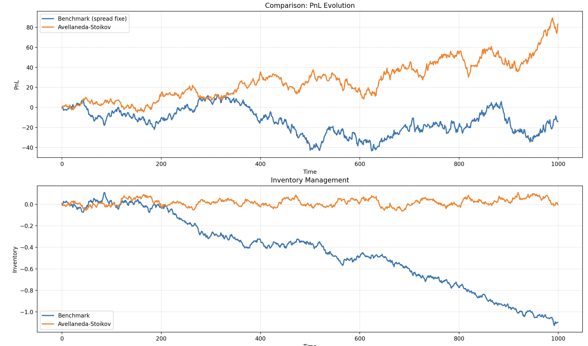

Benchmark vs Avellaneda-Stoikov

This project implements a comparative simulation of market making strategies between a fixed-spread benchmark approach and the optimal Avellaneda-Stoikov algorithm.

The primary objectives of this simulation are to model a realistic order book system with proper trade execution mechanics and implement the advanced Avellaneda-Stoikov algorithm for dynamic pricing optimization. We aim to conduct thorough performance comparisons of profit and loss metrics between simple and optimized strategies while analyzing how effective inventory management impacts overall trading profitability and risk exposure.

The simulation includes a complete order book system that comprehensively handles both limit and market orders with realistic execution mechanics. It features sophisticated Poisson-based simulation of order arrivals that dynamically responds to changing spread levels. The platform implements both a traditional benchmark strategy with constant spreads and basic inventory limits, as well as the advanced Avellaneda-Stoikov strategy that dynamically adjusts pricing based on real-time inventory risk assessment. Finally, the system provides powerful comparative visualization tools that enable detailed analysis of PnL performance and inventory management efficiency across both strategies.

The Avellaneda-Stoikov algorithm is expected to demonstrate superior risk-adjusted performance characteristics by dynamically optimizing spreads based on real-time inventory levels and market volatility conditions. 

Results : 

